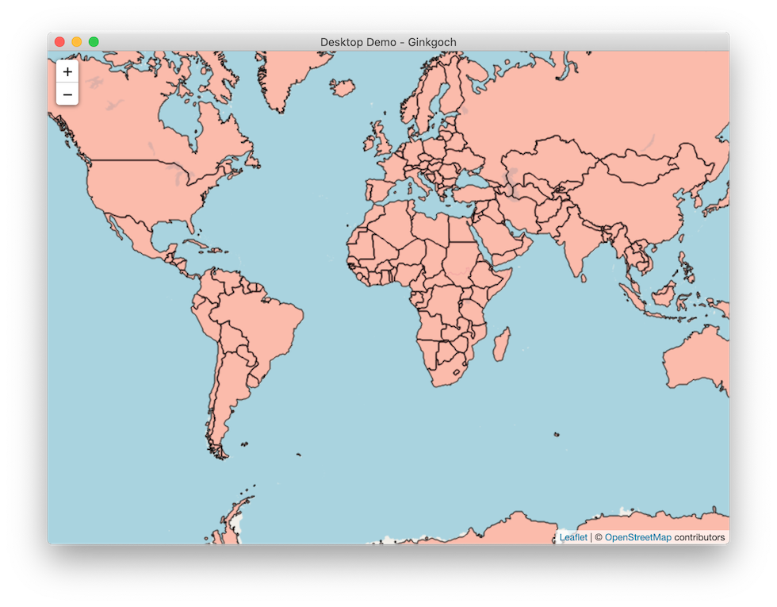

# Ginkgoch GIS Desktop with Electron Quick Start

This is a quick demo to build GIS desktop application with `electron` and `ginkgoch-map`. It loads a world Shapefile and render as tiles.



The easiest way to kickoff an `electron` env is to download its [quick-start demo](https://github.com/ginkgoch/electron-quick-start) or folk it, then use it as a project template in github.

Extract this downloaded demo or clone your project that is created by the project template and open with `vscode`. The initialized map and data are ready for you.

Type following command in terminal to launch this desktop application.

```bash
npm i
npm start
```